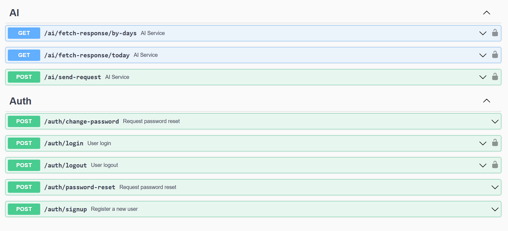

# Robo-Advisor AI & Backend Services

## 🧠 Overview
The **Robo-Advisor AI System** provides intelligent and personalized investment portfolio recommendations for banking customers using artificial intelligence. It analyzes key parameters such as:

- Customer's **age**, **location**, and **risk tolerance**
- Financial **goals**, **investment horizon**, and **knowledge level**
- Initial **investment amount** and **preferred currency**

It returns optimized portfolios that aim to maximize returns within acceptable risk limits, tailored to each user's profile.

---

## 🏗️ Project Structure

```bash
robo-advisor-backend-service/
├── config/                 # Configuration management
├── controllers/            # HTTP controller logic
├── routes/                 # Route definitions
├── utils/                  # Utility functions
├── main.go                 # App entry point
├── go.mod / go.sum         # Go modules
├── Dockerfile              # Docker build file
├── docker-compose.yml      # Multi-service orchestration (optional)
├── README.md               # Project overview and setup
└── docs/                   # Swagger docs generated via swag CLI
```

---

## 🌐 Live Deployment

- **Base API URL**: [https://robo-advisor-backend-service.onrender.com/api](https://robo-advisor-backend-service.onrender.com/api)
- **Swagger Docs**: [https://robo-advisor-backend-service.onrender.com/api/swagger/index.html](https://robo-advisor-backend-service.onrender.com/api/swagger/index.html)

---

## ⚙️ API Endpoints

---

## 📆 Sample Payload for Recommendation

```json
{
  "age": 30,
  "location": "US",
  "investmentKnowledge": "moderate",
  "investmentPurpose": "retirement",
  "investmentHorizon": 10,
  "riskTolerance": "medium",
  "amount": 50000,
  "currency": "USD"
}
```

---

## 🐳 Docker Setup

### Prerequisites

- [Docker](https://www.docker.com/)
- [Docker Compose](https://docs.docker.com/compose/)

### Run Locally

Clone the repository and run:

```bash
docker-compose up --build
```

### Services Started

- 🟢 **Backend API**: [http://localhost:8080](http://localhost:8080)
- 🟡 **Swagger UI**: [http://localhost:8080/api/swagger/index.html](http://localhost:8080/api/swagger/index.html)

> Note: Swagger docs are automatically generated with `swag init` and available inside `/docs`.

---

## 💠 Development Tips

- Regenerate Swagger docs after controller updates:
  ```bash
  swag init -g main.go
  ```
- Auto format code:
  ```bash
  go fmt ./...
  ```


## 🤝 Contribution

Pull requests, issues, and feature ideas are welcome!

---

## 📄 License

This project is licensed under the [MIT License](LICENSE).

---

